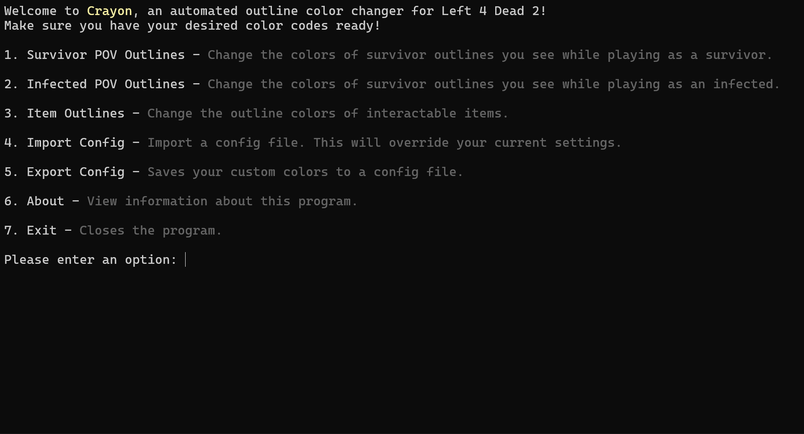
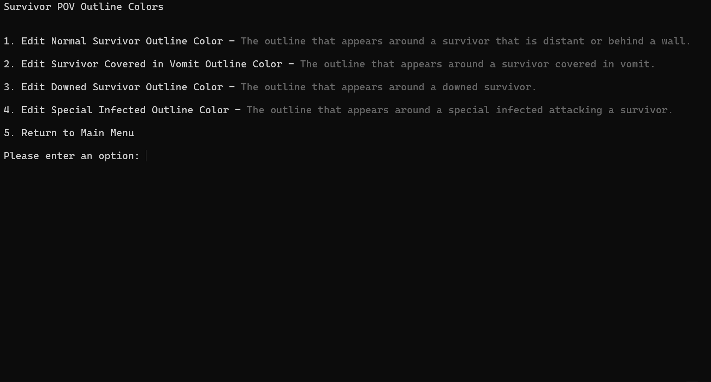
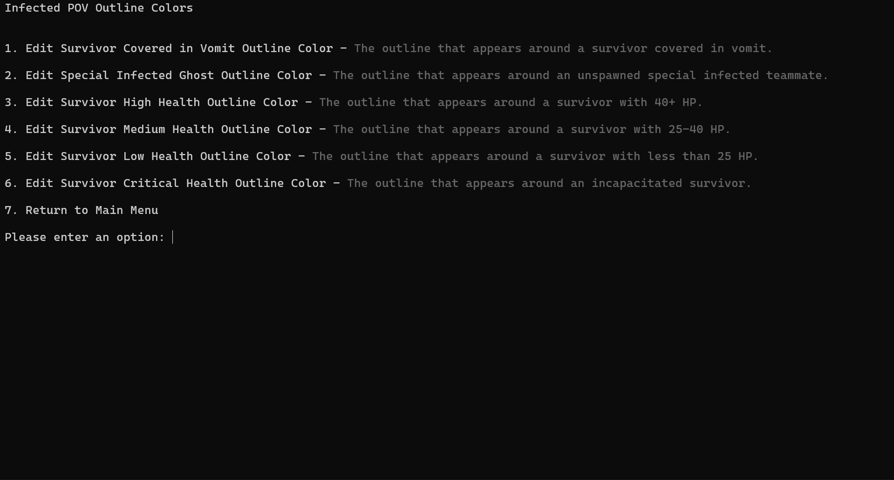

[](https://steamcommunity.com/sharedfiles/filedetails/?id=3651843640)
# Crayon 🖍️

**An automated outline color changer for Left 4 Dead 2.**

Crayon is a Python-based tool designed to help Left 4 Dead 2 players easily customize their in-game outline colors. Whether you are playing as a Survivor or Infected, Crayon allows you to fine-tune visual indicators for teammates, enemies, and items without manually editing configuration files.

## 📸 Screenshots

| Main Menu | Survivor Options |
|:---:|:---:|
|  |  |

**Infected POV Settings:**


## ✨ Features

* **Survivor POV Customization:** Change outline colors for distant teammates, players covered in vomit, downed survivors, and pinned teammates.
* **Infected POV Customization:** Change outline colors for unspawned teammates, players covered in vomit, and health-based states (High, Medium, Low, Critical).
* **Item Outlines:** Easily change the glow color of interactable items and weapons.
* **Config Management:**
    * **Import:** Load existing color configurations via a file dialog.
    * **Export:** Save your custom presets to share or backup.
* **User-Friendly Interface:** Simple text-based navigation with clear options.

## 🚀 Getting Started

## 📥 Installation

Note on Windows SmartScreen: Because Crayon is a new, independent tool, Windows may display a "Windows protected your PC" warning. This is normal for unrecognized apps. To run the program, click "More info" and then select "Run anyway".

### Option 1: Using the Standalone App (Recommended)
*Best for users who just want to use the tool without installing Python.*

1.  Go to the **[Releases](../../releases)** page of this repository.
2.  Download the latest `Crayon.exe`.
3.  Double-click the file to launch Crayon.
    * *Note: Since this is a new tool, Windows SmartScreen may treat it as unrecognized. You may need to click "More Info" > "Run Anyway".*

### Option 2: Run from Source
*Best for developers who want to modify the code.*

**Prerequisites:**
* Python 3.x installed.
* `tkinter` installed (usually included with Python).
* `colorama` installed (used for managing colored text).

**Steps:**
1.  Clone the repository:
    ```bash
    git clone [https://github.com/andyorsomething/crayon.git](https://github.com/andyorsomething/crayon.git)
    cd crayon
    ```
2.  Install the required libraries:
    ```bash
    pip install -r requirements.txt
    ```
3.  Run the application:
    ```bash
    python main.py
    ```


## 🛠️ Usage

1.  Launch the program.
2.  Use the number keys to navigate the menus.
3.  When prompted, enter your desired color codes (using hexadecimal format).
4.  Use **Export Config** to save your new settings file to a desired location.

## 🤝 Contributing

Contributions, issues, and feature requests are welcome! Feel free to check the [issues page](https://github.com/andyorsomething/crayon/issues).

## 📝 License


This project is licensed under the MIT License - see the [LICENSE](LICENSE) file for details.

